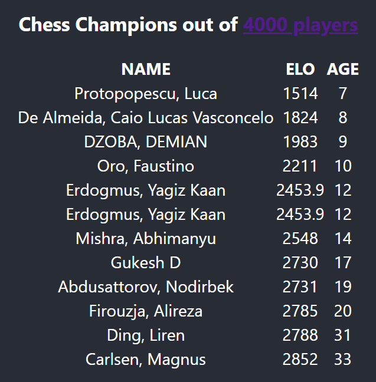

# L'énoncé

Tu as une liste de joueurs d'échecs avec leurs ages et scores (elo).\
Tu dois extraire de la liste les "champions".\
Un joueur est dit "champion" si et seulement si il n'y a personne d'autre dans la liste qui "l'élimine", c'est à dire:
- personne d'autre n'est a la fois strictement plus fort et plus jeune ou même age
  et
- personne d'autre n'est à la fois strictement plus jeune et plus fort ou même score

ta mission: dans le language de ton choix, coder la fonction permettant de trouver les champions de la liste

On attachera une importance particulière aux points suivants:
- L'exactitude des resultats: Le(a) candidat(e) a t-il(elle) pensé(e) à la logique d'ensemble et aux cas particuliers ?
- La performance: Comment se comporte l'algorithme à mesure que le nombre de joueurs grandit ?
- La clarté et la lisibilité du code

# Résultats

https://kevinkhau.github.io/chess-champions/

Consultez [ChessRankingService.tsx](src/ChessRankingService.tsx) pour un premier aperçu de l'algorithme.\
Les données d'échantillons de joueurs ont été récupérées sur https://chess-rankings.com/.

## Exactitude des résultats

Cas particuliers considérés :
- Aucun joueur
- Un seul joueur
- Plusieurs joueurs avec le même elo et âge
- Plusieurs joueurs avec le même nom, elo, et âge

## Performances
- Complexité en temps : **0(n)** avec deux parcours de liste
- Complexité en espace : **0(n)** avec la liste initiale de joueurs,
la liste des meilleurs joueurs par âge, puis la liste des champions. 

On peut donc jouer l'algorithme sur des millions de joueurs avant de se poser 
d'autres questions.

## Clarté et lisibilité du code

En accord avec les conventions de Clean Code, il conviendra de lire en premier les méthodes plus globales
en haut du fichier [ChessRankingService.tsx](src/ChessRankingService.tsx).